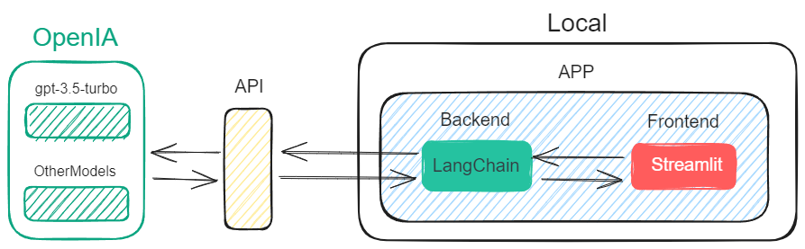

---

# SAM - Streamlit Chatbot powered by LangChain and OpenAI

</img>

## Description

SAMI is a chatbot developed with Streamlit, LangChain, and OpenAI, designed to provide useful and entertaining responses to users. This project demonstrates how to integrate large language models (LLMs) and OpenAI APIs to create an interactive and fun experience.

## Features

- **User Interface with Streamlit:** A simple and friendly UI for interacting with the chatbot.
- **Integration with OpenAI:** Uses the GPT-3.5-turbo (configurable) model from OpenAI to generate responses.
- **Conversation Context:** Maintains the conversation history to offer coherent and contextually relevant responses.
- **Embeddings and Document Retrieval:** Uses advanced embedding techniques and information retrieval to improve response accuracy.
- **Personalized Responses:** The personality can be configured via the **config.json** file.

## Installation

1. **Clone the repository:**
    ```bash
    git clone https://github.com/Luisarg03/StreamlitLangchainBot
    ```

2. **Create a virtual environment:**
    ```bash
    python -m venv myenv
    ```

3. **Activate the environment (Windows):**
    ```bash
    source myenv/bin/activate
    ```

4. **Install dependencies:**
    ```bash
    pip install -r requirements.txt
    ```

5. **Set up environment variables:**
    - Create a `.env` file in the project's root directory and add your OpenAI API key:
    ```env
    API_KEY=your_api_key
    ```

6. **Run the application:**
    ```bash
    streamlit run main.py
    ```

## Usage

1. **Start the application:** Run the command `streamlit run main.py`.
2. **Pdfs:** By default, the documents passed as context are located in the *./pdfs* folder.
3. **Interaction:** Enter your questions or comments in the chat interface, and SAM will respond with personalized answers.

# Diagrams

</img>

## License

This project is licensed under the MIT License. See the LICENSE file for more details.

---